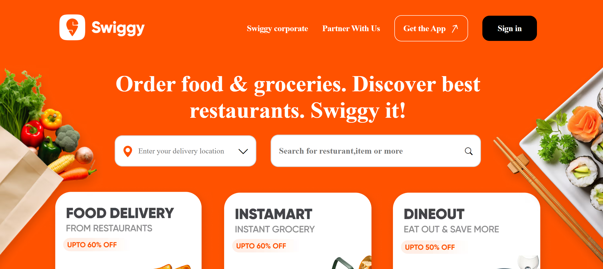

# 🍔 Swiggy Homepage Clone

This project is a **Swiggy Homepage Clone** built using **HTML, CSS, and JavaScript**.

The goal of this project was to practice frontend development by recreating the layout and design of the Swiggy landing page.

## 🚀 Features

- Responsive homepage layout
- Clean UI design
- Practice of real-world website structure
- Mobile friendly layout

## 🛠️ Technologies Used

- HTML
- CSS
- JavaScript

## 📸 Screenshot

## 💡 Learning Outcome

Through this project I improved my understanding of:

- Website layout
- Responsive design
- Frontend UI development

## 👩‍💻 Author

Ayushi Chouhan  
Frontend Developer (Learning React)

